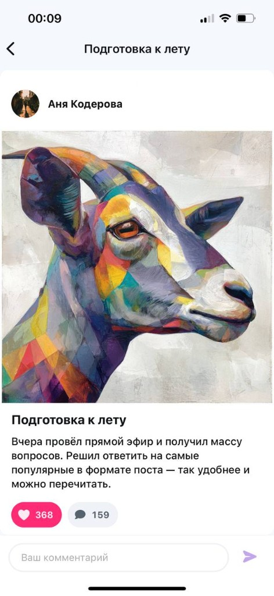
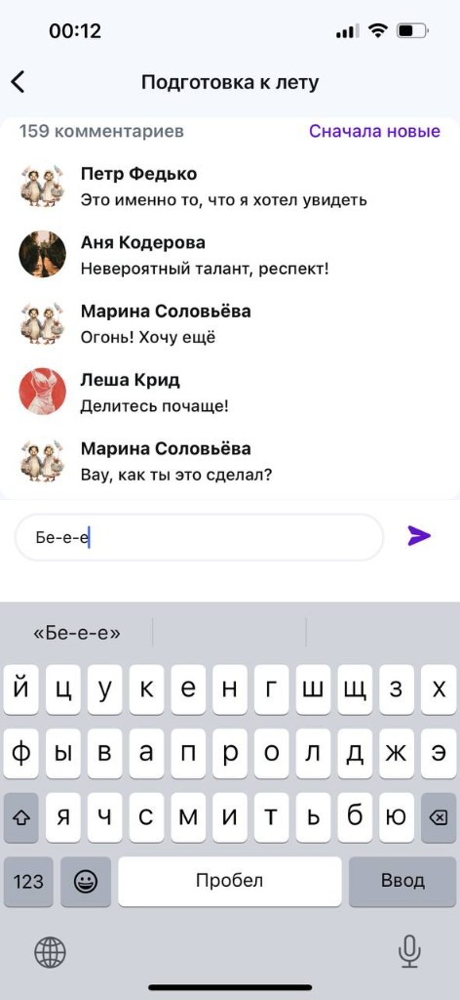
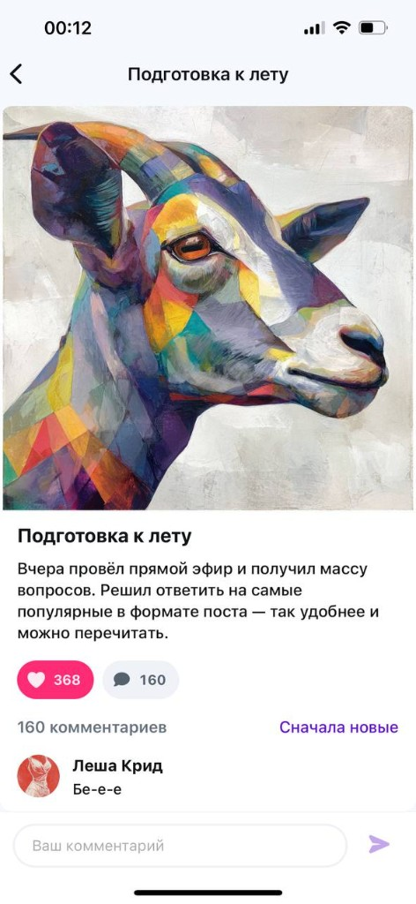

# Mecenate Feed — тестовое задание (React Native + Expo)

Мобильное приложение: **лента публикаций** и **экран поста** с лайками, комментариями и realtime-синхронизацией. Репозиторий оформлен как единый продукт из **двух частей** ТЗ; обе реализованы в одной кодовой базе.

## Технологии

| Слой | Выбор |
|------|--------|
| Платформа | React Native **0.81**, Expo SDK **54** |
| Язык | TypeScript |
| Серверное состояние | **TanStack React Query** (кэш, infinite query, мутации) |
| Локальное состояние | **MobX** (минимально, сессия и проч.) |
| Списки | **FlashList** |
| Анимации | **Reanimated** |
| Навигация | Native Stack (**@react-navigation/native-stack**) |
| Стили | Токены (`src/shared/theme`) |

## Исходное ТЗ и макеты

| Документ | Назначение |
|----------|------------|
| [docs/spec/mecenate-test-assignment-part-1.pdf](docs/spec/mecenate-test-assignment-part-1.pdf) | Первая часть: лента, пагинация, платный пост, ошибки |
| [docs/spec/mecenate-test-assignment-part-2.pdf](docs/spec/mecenate-test-assignment-part-2.pdf) | Вторая часть: деталка, лайк, комментарии, WebSocket |
| [Figma — лента / общий контекст](https://www.figma.com/design/6I7ZI9Tt5X8274EOKa3sv0/Test-Assignment--Copy-) | Вёрстка и UI-референсы |

## Часть 1 — лента

- Карточка поста: автор, обложка, превью, счётчики лайков и комментариев.
- Фильтры **Все / Бесплатные / Платные** (tier в запросе API).
- Курсорная пагинация и pull-to-refresh.
- Заглушка платного поста (`tier: "paid"`).
- Экран ошибки загрузки с повтором запроса.

### Скриншоты — лента


## Часть 2 — детальная публикация

- Переход **лента → деталка** (`postId` в параметрах стека).
- Вёрстка экрана по макету: карточка, метрики, блок комментариев.
- Лайк: анимация, haptics, optimistic-обновление и согласование с кэшем ленты.
- Комментарии: **один** `FlashList` с `ListHeaderComponent` (пост + шапка комментариев), infinite scroll, состояния loading / empty / error, pull-to-refresh поста и комментариев.
- Композер: поле «Ваш комментарий», отправка через мутацию, обновление кэша React Query (согласовано с событиями WS).
- **WebSocket**: подключение **только пока экран деталки в фокусе**; события обновляют те же query keys, без дублирования логики в кнопках.

### Скриншоты — деталка





## Требования и запуск

- **Node.js** 20.x или 22.x (LTS), **npm** 10+.
- **Expo Go** на устройстве; телефон и ПК в одной Wi‑Fi сети для режима `lan`.

```bash
npm install
npm run start
```

При проблемах с сетью:

```bash
npx expo start --tunnel
```

Если tunnel недоступен (ngrok):

```bash
npx expo start --lan -c
```

### Expo Go — короткий сценарий

1. Запустить Metro, открыть Expo Go, отсканировать QR.
2. Проверить ленту, табы tier, переход в пост.
3. На деталке: скролл комментариев, ввод, отправка; при уходе назад WebSocket отключается.

## Переменные окружения

- Шаблон: [.env.example](.env.example) → при необходимости скопировать в `.env`.
- `EXPO_PUBLIC_API_BASE_URL` — база REST; URL WebSocket строится в коде из того же хоста (`http`/`https` → `ws`/`wss`, путь `/ws?token=…`). После правок `.env` перезапустить Metro.

## Отладка ошибки ленты

В `src/shared/config/env.ts` флаг `simulateFeedError: true` добавляет к запросу ленты параметр `simulate_error=true` (ответ `500`) для проверки UI ошибки. После проверки вернуть `false`.

## Проверка для ревьюера

**Часть 1:** лента, пагинация, refresh, платный пост, экран ошибки (через флаг выше).

**Часть 2:** деталка, лайк, комментарии (список + отправка), согласованность счётчиков при возврате в ленту, работа WS на экране деталки.

### Регрессионный чеклист (лента)

1. Открыть ленту и проскроллить до подгрузки следующей страницы.
2. Во время подгрузки отключить интернет (Wi‑Fi/мобильные данные).
3. Убедиться, что вместо бесконечного спиннера внизу появляется footer-ошибка:
   `Не удалось загрузить ещё` и кнопка `Повторить`.
4. Включить интернет обратно и нажать `Повторить`:
   список должен продолжить пагинацию без перезапуска экрана.
5. Найти пост с длинным превью:
   при обрезке до 2 строк должна отображаться кнопка `Показать ещё`.
6. Нажать `Показать ещё`, проверить разворот полного текста,
   затем нажать `Свернуть` и убедиться, что снова 2 строки.

## Архитектурные заметки

- **Один источник правды по данным** — кэш React Query; REST и WebSocket лишь обновляют ключи (`post-detail`, `comments`, лента).
- **Один вертикальный скролл** на деталке: контент поста в шапке списка, не вложенный `ScrollView` внутри списка.
- Сборка типов: `npm run typecheck`.
