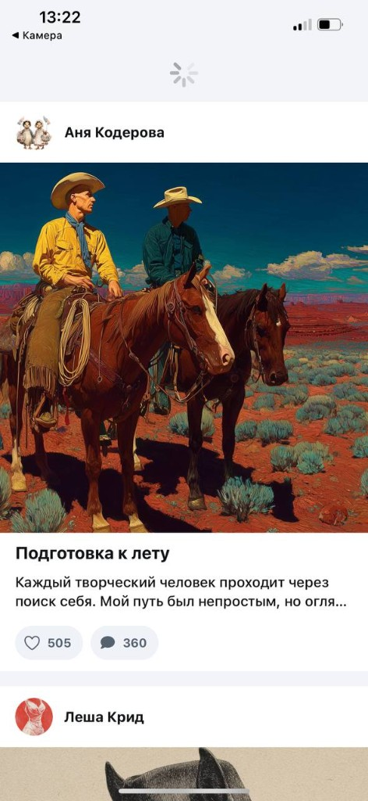
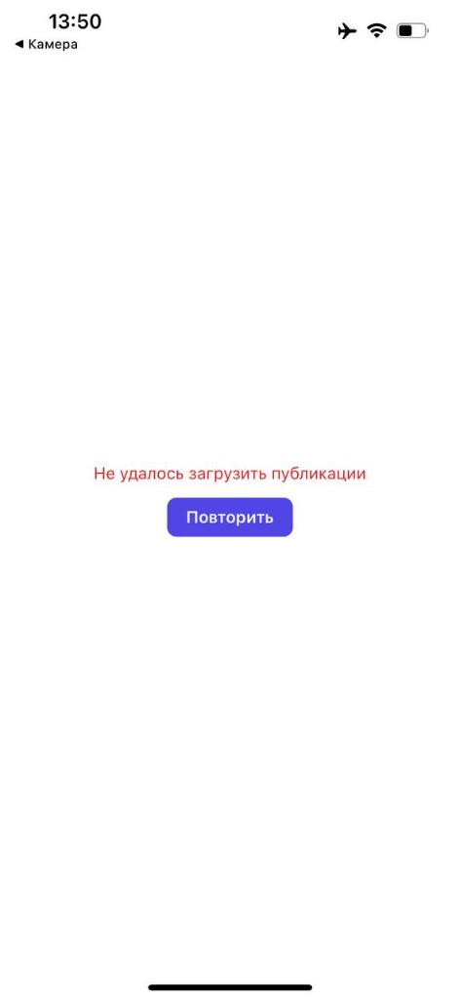

# Mecenate Feed Test (Task 1)

Мобильное тестовое задание на React Native + Expo: экран ленты публикаций для сервиса Mecenate.

## Статус проекта

- Task 1: завершен (реализован и проверяем в Expo Go).
- Task 2: в планах/в процессе, отдельный короткий контекст в `docs/brief.md`.

## Что реализовано по ТЗ (Task 1)

- Экран ленты: аватар автора, имя, обложка, превью, лайки и комментарии.
- Курсорная пагинация (`/posts?cursor=...`) при скролле вниз.
- Pull-to-refresh.
- Заглушка для платного поста (`tier: "paid"`).
- Экран ошибки загрузки «Не удалось загрузить публикации» с кнопкой «Повторить».

## Скриншоты





## Prerequisites

- Node.js 20+ (рекомендуется LTS).
- npm 10+.
- Expo Go на телефоне (iOS/Android).
- Телефон и компьютер в одной сети Wi-Fi для режима `lan`.

## Установка и запуск

```bash
npm install
npm run start
```

Если в вашей сети есть проблемы с `lan`, можно попробовать:

```bash
npx expo start --tunnel
```

Если `tunnel` падает с ошибкой ngrok, используйте:

```bash
npx expo start --lan -c
```

## Запуск через Expo Go

1. Запустите Metro (`npm run start` или `npx expo start --lan -c`).
2. Откройте Expo Go на телефоне.
3. Отсканируйте QR-код из терминала.
4. Дождитесь загрузки ленты.

## Переменные окружения

Переменных окружения (`.env`) в проекте нет.

## Отладочный флаг для проверки экрана ошибки

Для быстрого показа ошибки загрузки ленты есть debug-флаг в `src/shared/config/env.ts`:

```ts
simulateFeedError: true
```

Когда флаг включен, запрос `/posts` отправляется с `simulate_error=true`, и API возвращает `500` для проверки экрана ошибки. После проверки верните значение в `false`.

## Проверочный сценарий для ревьюера (Task 1)

1. Открыть приложение в Expo Go.
2. Проверить рендер карточек в ленте.
3. Пролистать вниз и убедиться, что работает догрузка (курсорная пагинация).
4. Потянуть ленту вниз и проверить pull-to-refresh.
5. Найти платный пост и проверить заглушку.
6. Включить `simulateFeedError: true` и проверить экран ошибки + кнопку «Повторить».

## Осознанные решения и ограничения

- Для стабильной проверки состояния ошибки добавлен локальный debug-флаг вместо ручного отключения сети на телефоне.
- В README описан рабочий запуск через `lan`; `tunnel` зависит от доступности ngrok и может быть недоступен в отдельные моменты.
